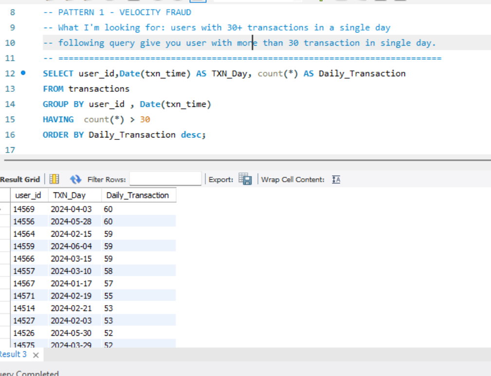
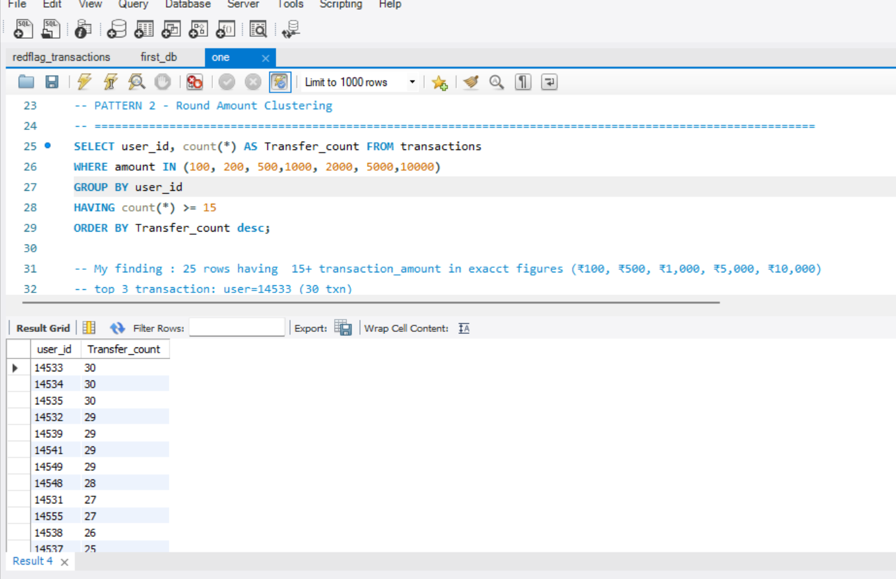
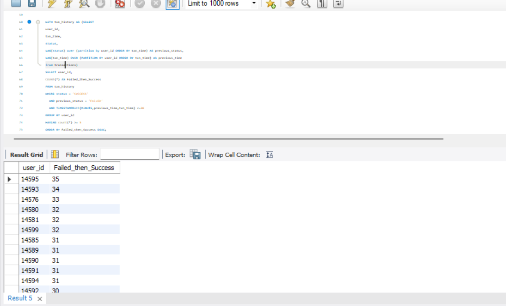
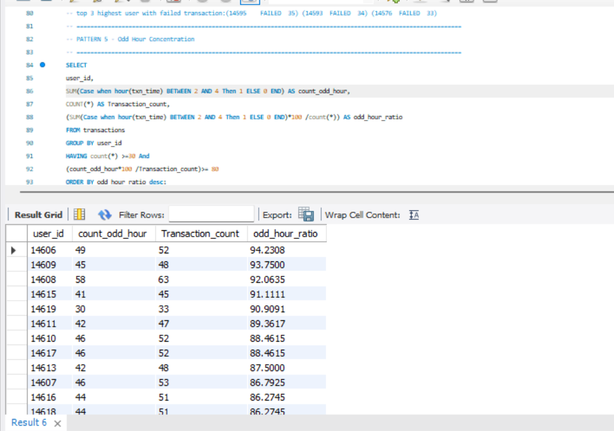
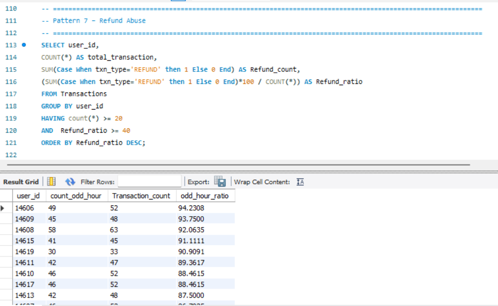

# 🚨 RedFlag – Fraud Detection Using SQL

## 📌 Overview

RedFlag is a SQL-based fraud detection project that analyzes banking transactions and identifies suspicious activities using multiple fraud detection rules.

This project demonstrates real-world SQL techniques used in banking and fintech fraud analytics.

---

## 🛠 Technologies Used

- MySQL 8
- SQL
- Common Table Expressions (CTEs)
- Window Functions
- Aggregate Functions
- Date & Time Functions

---

# 📂 Dataset

The project uses a synthetic banking transaction dataset containing customer transactions, merchant details, payment methods, transaction status, cities, and timestamps.

---

# 🔍 Fraud Detection Patterns

| Pattern | Description |
|---------|-------------|
| ✅ Velocity Fraud | 30+ transactions in a single day |
| ✅ Round Amount Clustering | Exact transaction amounts like ₹100, ₹500, ₹1000 |
| ✅ Card Testing | Multiple low-value transactions |
| ✅ Failed Then Succeeded | Failed payment immediately followed by success |
| ✅ Odd Hour Concentration | Transactions between 2 AM and 4 AM |
| ✅ Mule Accounts | Excessive NetBanking credit transactions |
| ✅ Refund Abuse | High refund ratio |
| ✅ Merchant Collusion | Top users dominate merchant revenue |
| ✅ Structuring | Multiple ₹9999 transactions |
| ✅ Dormant Then Active | Long inactivity followed by heavy activity |
| ✅ Velocity Spike | Sudden monthly transaction spike |
| ✅ Geographic Impossibility | Different cities within 60 minutes |

---

# 📊 Key Findings

| Pattern | Result |
|---------|-------:|
| Velocity Fraud | 50 suspicious users |
| Round Amount Clustering | 25 users |
| Card Testing | 20 users |
| Failed → Success | Detected using window functions |
| Odd Hour Concentration | 20 users |
| Mule Accounts | 30 users |
| Refund Abuse | 25 users |
| Merchant Collusion | 15 merchants |
| Structuring | 20 users |
| Dormant → Active | 26 users |
| Velocity Spike | 3 users (AVG-based approach) |
| Geographic Impossibility | 15 users |

---

# 🚩 Cross-Pattern Analysis

The following users appeared in multiple fraud detection patterns:

| User ID | Fraud Patterns |
|---------|----------------|
| **14556** | Velocity Fraud, Card Testing |
| **14569** | Velocity Fraud, Card Testing |

These users should be prioritized for manual investigation.

---

# 💡 SQL Concepts Demonstrated

- Common Table Expressions (CTEs)
- Window Functions (`LAG`, `ROW_NUMBER`)
- Aggregate Functions
- Conditional Aggregation
- `DATEDIFF()`
- `TIMESTAMPDIFF()`
- `GROUP BY`
- `HAVING`
- Complex Fraud Analytics Queries

---

# 📸 Sample Outputs

### Pattern 1 – Velocity Fraud

### Pattern 2 – Round Amount Clustering

### Pattern 4 – Failed Then Succeeded

### Pattern 5 – Odd Hour Concentration

### Pattern 7 – Refund Abuse

---

# 👨‍💻 Author

**Kashif Ahmad Abdul Jahangir**

- 🎓 Computer Engineering Student
- 📍 Pune, Maharashtra, India

GitHub: https://github.com/kashifJAhmad

---

⭐ If you found this project interesting, feel free to star the repository.
